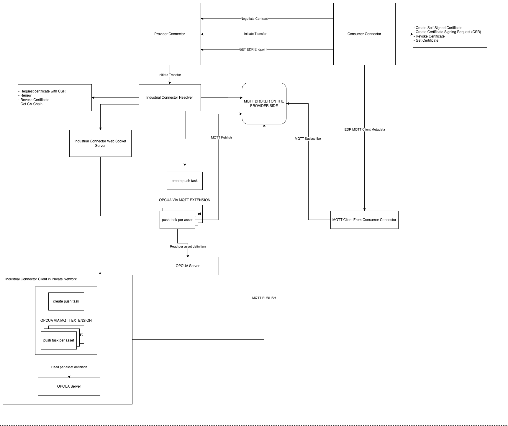

# Industrial Connector – OPC UA / MQTT Data Sharing over Eclipse Dataspace Components (EDC)

## Overview

This project extends the [Minimum Viable Dataspace (MVD)](https://github.com/eclipse-edc/MinimumViableDataspace) with an **Industrial Connector** that enables secure, policy-governed data sharing from OPC UA machinery through an MQTT broker. It is designed to integrate industrial shop-floor data into a dataspace without exposing raw OPC UA endpoints to external parties.

The industrial extensions live on the **provider side** (specifically the `provider-qna` connector runtime). A consumer negotiates a contract and initiates a transfer through the standard EDC protocol; the provider-side extensions take over and stream live OPC UA readings to a Mosquitto MQTT broker. The consumer then subscribes to the agreed MQTT topic using the credentials returned through the EDR (Endpoint Data Reference).

---

## Architecture



The main participants in the dataspace are:

| Participant | Role |
|-------------|------|
| `consumer-connector` | Initiates catalog queries, contract negotiations, and transfer requests |
| `provider-connector-qna` | Hosts the Industrial Connector extensions; reads from OPC UA and pushes data to MQTT |
| `provider-connector-manufacturing` | Standard provider (no industrial extensions) |
| `provider-catalog-server` | Aggregates provider catalogs |
| `identityhub-provider` / `identityhub-consumer` | Issue and verify Verifiable Credentials (DCP/VC) |
| `issuer-service` | Issues credentials to participants |
| `opcua-server` | Sample OPC UA server exposing machine data (port `4840`) |
| `mosquitto-dynsec` | Eclipse Mosquitto MQTT broker with Dynamic Security plugin (port `1883` / `8883` with TLS) |
| `nginx` | Serves DID documents required for decentralised identity resolution (port `9876`) |

The Industrial Connector is composed of three cooperating EDC extensions, all loaded into the `provider-qna` runtime:

```
industrial-connector-resolver  ←  always active (when edc.industrial.connector.extension.enabled=true)
       │
       ├──  industrial-connector-local  ←  active when edc.industrial.connector.wss.enabled=false
       │
       └──  industrial-connector-wss    ←  active when edc.industrial.connector.wss.enabled=true
```

---

## Extension Details

### 1. `industrial-connector-resolver`

The resolver extension is the entry point for all industrial data transfers. It:

- Registers an `IndustrialConnectorDataFlow` handler into the EDC `DataFlowManager`.
- Reads the common configuration (`edc.industrial.connector.*` properties).
- Sets up the **Mosquitto Dynamic Security** provisioner (`SecurityService`) to create per-transfer MQTT users, roles, and topic permissions on demand.
- Optionally sets up the **PKI Certificate Service** (`PkiCertificateService`) used for TLS-based MQTT authentication.
- On startup, wires the active `TransferFlowService` (provided by either `industrial-connector-local` or `industrial-connector-wss`) into the data flow handler.

Key configuration flag: `edc.industrial.connector.extension.enabled=true`

---

### 2. `industrial-connector-local` (Direct / Local Mode)

**Activated when:** `edc.industrial.connector.wss.enabled=false` *(default)*

In this mode the connector runtime itself handles the entire transfer lifecycle:

1. Upon receiving a `MQTT-PUSH` transfer request the `IndustrialConnectorLocalTransferServiceImpl` is invoked.
2. It spins up an OPC UA client (`OpcUaClientService`) that connects to the configured OPC UA server (`opc.tcp://…`).
3. Polled readings are forwarded to the Mosquitto broker (`OpcUaMqttPushServiceImpl`) on the asset-specific topic at the configured `pushInterval` (default `5000 ms`).
4. Per-transfer Mosquitto credentials are created (username/password or certificate-based) and returned to the consumer inside the EDR `DataAddress`.
5. On transfer termination, the OPC UA polling task is cancelled and the Mosquitto user/role/ACL entries are cleaned up.

This mode is suitable when the OPC UA server is **directly reachable** from the machine running the provider connector.

---

### 3. `industrial-connector-wss` (WebSocket / Firewall-Traversal Mode)

**Activated when:** `edc.industrial.connector.wss.enabled=true`

In environments where the OPC UA server sits **behind a firewall** or inside a plant network where operators do not allow direct external access, the WebSocket extension provides a firewall-traversal mechanism:

1. On startup, the extension launches a **WebSocket server** (default port `8181`, path `/industrial-ws`).
2. A separate **client application** (distributed as a companion repository) runs inside the plant network, establishes an outbound WSS connection to this server, and registers itself as an agent for a given OPC UA endpoint.
3. When a transfer request arrives, the resolver delegates to `IndustrialConnectorWssTransferFlowImpl`, which sends the OPC UA read command to the connected client application over the WebSocket channel.
4. The client application reads the OPC UA node(s) and forwards the data to the Mosquitto broker — performing exactly the same behaviour as the local extension, but from inside the plant network.
5. The EDR returned to the consumer contains the same MQTT broker endpoint and credentials.

| Setting | Default | Description |
|---------|---------|-------------|
| `edc.industrial.wss.port` | `8181` | WebSocket server listening port |
| `edc.industrial.wss.path` | `/industrial-ws` | WebSocket endpoint path |
| `edc.industrial.wss.idle.timeout` | `300` | Idle connection timeout (seconds) |

> **Note:** The WSS client application must be running and connected **before** a transfer can succeed in this mode.

---

## MQTT Authentication Modes

Both local and WSS modes support two MQTT authentication strategies, controlled by `edc.industrial.connector.cert.auth.enabled`:

### Username / Password (default)

```properties
edc.industrial.connector.cert.auth.enabled=false
edc.opcua.mqtt.broker.url=tcp://localhost:1883
edc.opcua.mqtt.admin.username=admin
edc.opcua.mqtt.admin.password=admin
edc.opcua.mqtt.username=push-user
edc.opcua.mqtt.password=pass123
```

The Mosquitto Dynamic Security plugin is used to create a dedicated user and role for each transfer. Credentials are returned to the consumer in the EDR and revoked automatically on transfer termination.

### Certificate-Based / TLS

```properties
edc.industrial.connector.cert.auth.enabled=true
edc.opcua.mqtt.broker.url=ssl://localhost:8883
edc.opcua.mqtt.ca.cert.path=deployment/mosquitto-dynsec/certs/ca-chain.cert.pem
edc.opcua.mqtt.admin.cert.path=deployment/mosquitto-dynsec/certs/admin-cert.crt
edc.opcua.mqtt.admin.key.path=deployment/mosquitto-dynsec/certs/admin-cert.key.pem
edc.opcua.mqtt.push.user.cert.path=deployment/mosquitto-dynsec/certs/push-user.crt
edc.opcua.mqtt.push.user.key.path=deployment/mosquitto-dynsec/certs/push-user.key.pem
```

In this mode the consumer must supply a **Certificate Signing Request (CSR)** in the transfer request body. The PKI service signs the CSR, and the resulting certificate and CA chain are returned in the EDR so the consumer can authenticate to the broker with mutual TLS.

> **Important (TLS workflow):** When running with TLS enabled, the consumer must:
> 1. **Create a self-signed certificate** _or_ **generate a CSR** via the PKI service **before** initiating a transfer (available as menu options `6` and `7` in `run-dataspace-interactive.sh`).
> 2. Complete **contract negotiation** first (steps 1 → 2 → 3 in the interactive menu).
> 3. Only then **initiate the transfer** (step 4), including the CSR in the `dataDestination` field.
>
> The PKI service endpoint and API key are configured via:
> ```properties
> edc.industrial.connector.pki.endpoint.url=http://localhost:5114
> edc.industrial.connector.pki.endpoint.key=ff94fd70-7f06-45ed-98af-046abf99600d
> ```

---

## Project Configuration

Configuration for the `provider-connector-qna` is split into two locations depending on the run mode:

| Location | Used for |
|----------|----------|
| `deployment/assets/env/provider_connector_qna.env` | **Docker Compose** run – service hostnames match container names (e.g. `mosquitto-dynsec`, `identityhub-provider`) |
| `deployment/assets/env_local/provider_connector_qna.env` | **Local (host) run** – all hostnames resolve to `localhost` |

The key flags you can toggle in either file are:

| Property | Default | Description |
|----------|---------|-------------|
| `edc.industrial.connector.extension.enabled` | `true` | Master switch for the entire Industrial Connector |
| `edc.industrial.connector.wss.enabled` | `false` | `false` → local mode; `true` → WebSocket / firewall-traversal mode |
| `edc.industrial.connector.cert.auth.enabled` | `false` | `true` enables TLS/certificate-based MQTT authentication |
| `edc.industrial.connector.pki.endpoint.url` | — | URL of the PKI service (required when cert auth is enabled) |
| `edc.industrial.connector.pki.endpoint.key` | — | API key for the PKI service |
| `edc.opcua.mqtt.broker.url` | `tcp://localhost:1883` | MQTT broker URL (`tcp://` for plain, `ssl://` for TLS) |

---

## Running Locally (Host)

### Prerequisites

- JDK 17+
- Docker (for dependency containers)
- `newman` CLI (`npm install -g newman`) for data seeding

### Step 1 – Start Infrastructure Dependencies

Run the following script to start the three required infrastructure services as Docker containers:

```bash
./run-local-dependencies.sh
```

This script will prompt you to choose between:

- **Option 1 – Plain MQTT (port 1883):** Starts Mosquitto using the standard config at `deployment/mosquitto-dynsec/config/`.
- **Option 2 – TLS MQTT (ports 1883 and 8883):** Starts Mosquitto using the TLS config at `deployment/mosquitto-dynsec/config-cert/` and mounts certificates from `deployment/mosquitto-dynsec/certs/`.

In both cases the script also starts:

| Container | Image | Port | Purpose |
|-----------|-------|------|---------|
| `mosquitto-dynsec` | `eclipse-mosquitto:2` | `1883` (plain) / `8883` (TLS) | MQTT broker with Dynamic Security plugin |
| `opcua-server` | `ghcr.io/umati/sample-server:main` | `4840` | Sample OPC UA server exposing machine data |
| `nginx` | `nginx` | `9876` | Serves DID documents for identity resolution |

### Step 2 – Build the Project

```bash
./gradlew build
```

### Step 3 – Launch the Dataspace Runtimes

Start each EDC runtime using its environment file from `deployment/assets/env_local/`. Refer to the individual launcher configurations in the `launchers/` directory for JAR arguments.

### Step 4 – Seed the Dataspace

```bash
./seed.sh       # seeds base dataspace assets, policies, and credentials
./seed-mqtt.sh  # seeds OPC UA MQTT assets to provider-qna and provider-manufacturing
```

`seed-mqtt.sh` uses the Postman collection `deployment/postman/MVD-OPCUAMQTT.postman_collection.json` via `newman` to register:
- OPC UA MQTT assets and policies on `provider-qna` (management API port `8191`)
- OPC UA MQTT assets and policies on `provider-manufacturing` (management API port `8291`)
- Linked catalog entries on the `provider-catalog-server` (management API port `8091`)

### Step 5 – Interact with the Dataspace

Once the runtimes are running and the seed scripts have completed, you can use the interactive script to test the full transfer flow **without** restarting anything or re-seeding:

```bash
./run-dataspace-interactive.sh
```

When prompted, select **option 2 – "Use existing setup"**. The script will skip Docker Compose and seed steps entirely and go straight to the interactive operations menu:

```
================================
Dataspace Interactive Menu
================================
1. Get Asset Catalog
2. Initiate Contract Negotiation
3. Check Contract Negotiation Status
4. Initiate Transfer
5. Get EDR Endpoint
6. Create Self-Signed Certificate
7. Create CSR (Certificate Signing Request)
8. Show Current Status
9. Exit
```

This lets you walk through the full dataspace flow — catalog query → contract negotiation → transfer initiation → EDR retrieval — against the locally running runtimes. See the [Transfer Workflow](#step-2--transfer-workflow) section for a step-by-step guide.

---

## Running with Docker Compose

### Step 0 – Rebuild Docker Images After Configuration Changes

> **Important:** Whenever you change any configuration file (e.g. `.env` files under `deployment/assets/env/`, `docker-compose.dataspace.yml`, or any source code), you must rebuild the Docker images before starting the dataspace. The build command must be run from the `deployment/` folder:

```bash
cd deployment
docker-compose -f docker-compose.dataspace.yml build
```

Skipping this step after a configuration change will cause the containers to run with stale settings. Once the build is complete, return to the project root to run the interactive script or start the stack manually.

### Step 1 – Start the Full Dataspace Interactively

The `run-dataspace-interactive.sh` script automates the entire Docker Compose lifecycle and provides an interactive menu for all dataspace operations:

```bash
./run-dataspace-interactive.sh
```

On first run it will ask whether to:
1. **Start fresh** – stops any existing containers, starts Docker Compose with the selected profile, and runs the full seed sequence.
2. **Use existing setup** – skip startup/seeding and go directly to the operations menu.

If starting fresh, it also asks which MQTT profile to use:
- **plain** – starts `mosquitto` service (port `1883`)
- **tls** – starts `mosquitto-tls` service (port `8883` with certificates)

The script then launches the following menu:

```
================================
Dataspace Interactive Menu
================================
1. Get Asset Catalog
2. Initiate Contract Negotiation
3. Check Contract Negotiation Status
4. Initiate Transfer
5. Get EDR Endpoint
6. Create Self-Signed Certificate
7. Create CSR (Certificate Signing Request)
8. Show Current Status
9. Exit
```

The menu guides you through the full transfer lifecycle sequentially. State (Asset ID, Policy ID, Contract IDs, Transfer ID, CSR) is preserved across steps within the same session.

### Step 2 – Transfer Workflow

#### Plain MQTT (no TLS)

1. **Get Asset Catalog** – queries the provider catalog and extracts asset and policy IDs.
2. **Initiate Contract Negotiation** – submits a contract offer to the provider.
3. **Check Contract Negotiation Status** – poll until state is `FINALIZED` and the Contract Agreement ID is extracted.
4. **Initiate Transfer** – submits an `MQTT-PUSH` transfer request. The connector reads OPC UA data and starts pushing to the configured topic.
5. **Get EDR Endpoint** – retrieves the MQTT broker URL, topic, username, and password from the EDR. Use these to subscribe to the data stream.

#### TLS / Certificate-Based MQTT

The same steps apply, plus the following must be performed **between steps 3 and 4**:

1. **Create Self-Signed Certificate** (menu option `6`) – calls the PKI service to generate a certificate for the consumer identity.
2. **Create CSR** (menu option `7`) – generates a CSR via the PKI service. The CSR PEM is stored in session state and automatically included in the transfer request body (option `4`).

The connector signs the CSR, creates a per-transfer MQTT ACL entry, and returns the signed certificate plus CA chain in the EDR so the consumer can connect to the broker over mutual TLS.

### Docker Compose Services

The `deployment/docker-compose.dataspace.yml` defines the following services:

| Service | Ports | Description |
|---------|-------|-------------|
| `identityhub-consumer` | `7080–7083`, `7085–7086` | Consumer identity hub (W3C DID, VC) |
| `identityhub-provider` | `7090–7093`, `7095–7096` | Provider identity hub |
| `issuer-service` | `10010–10015` | VC issuer (credential issuance) |
| `provider-catalog-server` | `8091–8092` | Provider catalog aggregator |
| `provider-connector-qna` | `8190–8195`, `8181`, `12001` | Industrial connector; also exposes WebSocket on `8181` (WSS mode) |
| `provider-connector-manufacturing` | `8290–8295`, `12002` | Standard provider connector |
| `consumer-connector` | `8080–8085`, `11001` | Consumer connector |
| `mosquitto` *(profile: plain)* | `1883` | MQTT broker, plain config |
| `mosquitto-tls` *(profile: tls)* | `8883` | MQTT broker, TLS config |
| `opcua-server` | `4840` | Sample OPC UA server |
| `nginx` | `9876` | DID document server |

---

## Directory Structure (Industrial Connector relevant paths)

```
extensions/
├── industrial-connector-resolver/   # Main orchestrator & DataFlowManager registration
├── industrial-connector-local/      # Direct OPC UA → MQTT push (local mode)
└── industrial-connector-wss/        # WebSocket server for firewall-traversal mode

deployment/
├── docker-compose.dataspace.yml     # Full dataspace Docker Compose
├── mosquitto-dynsec/
│   ├── config/                      # Plain Mosquitto config (Dynamic Security)
│   ├── config-cert/                 # TLS Mosquitto config
│   └── certs/                       # TLS certificates (CA, admin, push-user)
└── assets/
    ├── env/                         # Docker Compose environment files
    └── env_local/                   # Local (host) environment files

scripts/
run-local-dependencies.sh            # Start OPC UA server, Mosquitto, and nginx
run-dataspace-interactive.sh         # Interactive Docker Compose + operations menu
seed.sh                              # Seed base dataspace (assets, policies, credentials)
seed-mqtt.sh                         # Seed OPC UA MQTT assets via Postman/newman
```

---
This README focuses on the architecture, extension layout, and runtime behavior of the Industrial Connector.

For installation, configuration, seeding, and day-to-day usage instructions, see [SETUP.md](./SETUP.md).
For running, see [RUNNING.md](./docs/RUNNING.md).
