# Minimum Viable Dataspace — OPC-UA Extension Guide

First, check the [README](../README.md) to set up the solution.

The solution can be run as a standalone application (console app) or in a Docker container. Regardless of the chosen runtime mode, dependencies must be started separately using the `run-local-dependencies.sh` script. Docker must be installed on the host machine.

This ensures that the OPC-UA server, Nginx, and the Mosquitto MQTT broker are all running.

The solution can run with certificates or as a plain application (no SSL).

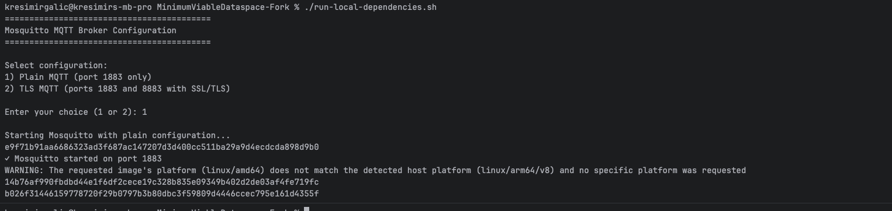

---

## Standalone Application Run

Configuration is located at:

```
deployment/assets/env_local/provider_connector_gna.env
```

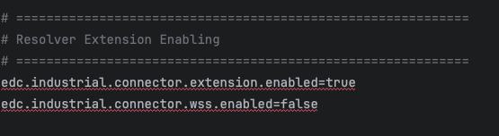

This configuration enables the extension for the `provider-qna` connector and contains the flag that controls the operating mode:

- **`wss.enabled=false`** — The extension runs fully locally, meaning the OPC-UA server and the extension are in the same network.
- **`wss.enabled=true`** — The extension is split into two independently deployable parts:
  - **Server part** — responsible for handling transfer requests.
  - **Client part** — can be placed in a different network, co-located with the OPC-UA server.

In the split mode, the client requires an outbound connection to reach the server via WebSockets. Upon receiving a transfer request, it creates push tasks that read data from the OPC-UA server (as defined in the asset) and push that data to the MQTT broker shared between the consumer and the provider.

Further settings that can be enabled are shown in the screenshot below — these effectively enable certificate authentication.

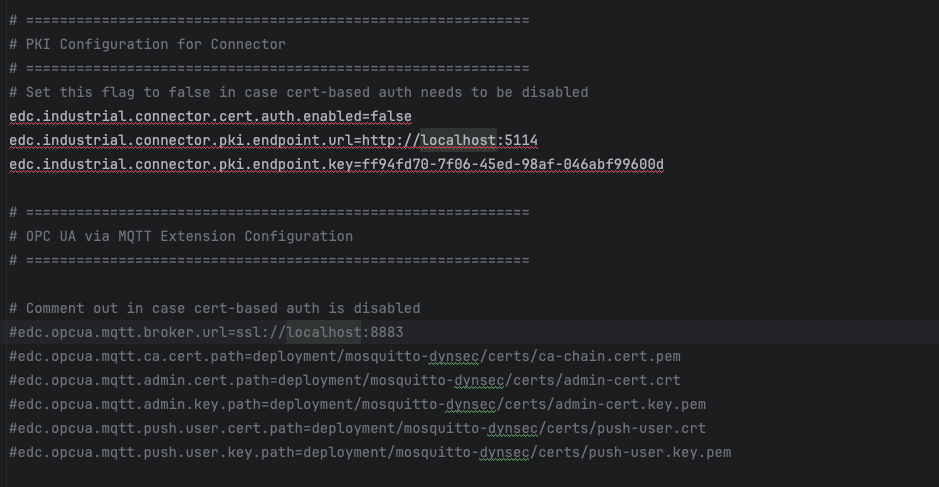

With this repository, some provisional certificates are provided, but it is strongly encouraged to establish your own certificate infrastructure for any non-trivial deployment.

When `cert-auth` is enabled, the MQTT broker requires certificate-based authentication, where the certificate's **Common Name (CN)** serves as the username. In that case, the certificate authentication section in the Mosquitto configuration must be uncommented, and the username/password authentication section must be commented out.

The rest of the configuration is unchanged from the upstream repository.

---

## Running the Solution

Assuming the solution has been configured as described in the [README](../README.md), it can be run in the following modes.

### Locally

After building the solution, run the `dataspace` configuration from the IDE of your choice. This starts the full Minimum Viable Dataspace, including all consumer and provider components (7 applications in total).

Upon a successful start of `provider-qna` (runtime-embedded), the following output is visible:

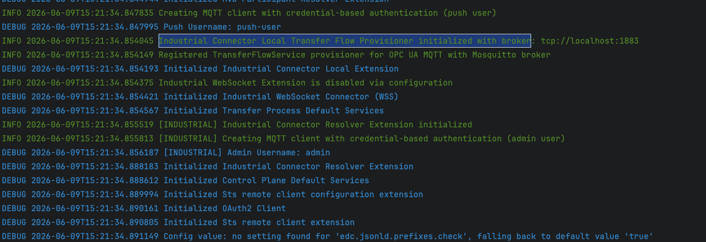

Next, run `seed.sh` to prepare the dataspace with a provisional setup, including a provisional asset:

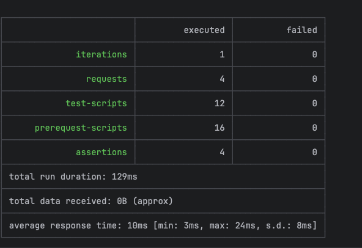

Then run `seed-mqtt.sh`:

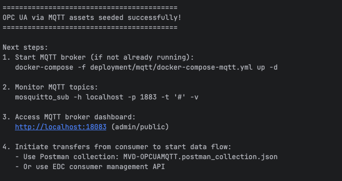

To interact with the solution, use the `run-dataspace-interactive.sh` script, which simulates consumer interaction via an interactive console.

Since the application has already been started and seeded manually, select **option 2**:

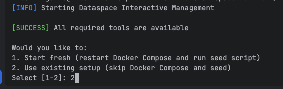

This opens a dialog for interacting with the consumer and simulating a real-world data-sharing scenario:

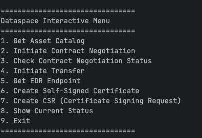

```
1. Get Asset Catalog
2. Initiate Contract Negotiation
3. Check Contract Negotiation Status
4. Initiate Transfer
5. Get EDR Endpoint
6. Create Self-Signed Certificate
7. Create CSR (Certificate Signing Request)
8. Show Current Status
9. Exit
```

Executing commands **1 through 5** in sequence walks through the complete flow: asset discovery → contract negotiation → transfer initiation.

> **Important:** The contract negotiation must reach the **FINALIZED** state before initiating a transfer. Any other state will cause the transfer to fail.

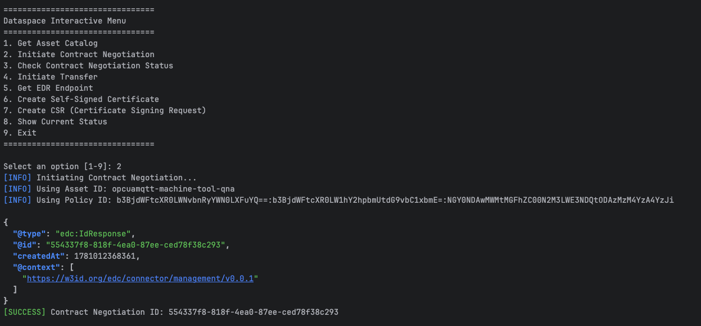

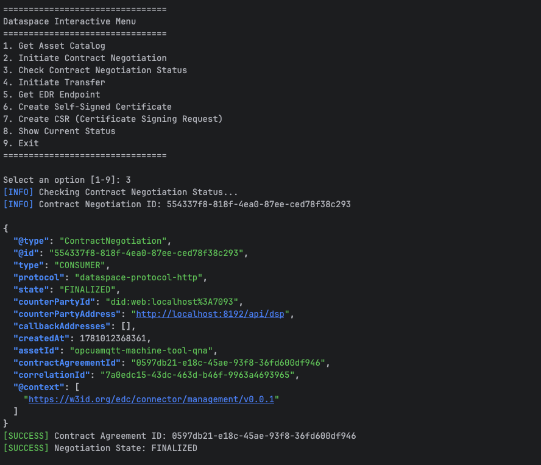

The transfer process can now be started:

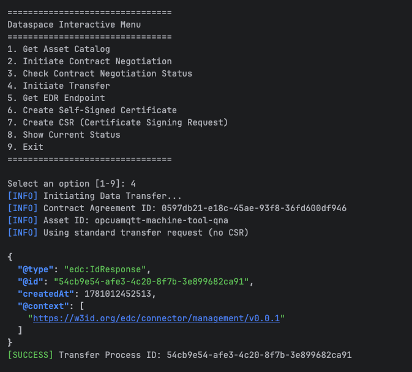

Upon completion, the EDR endpoint returns the credentials:

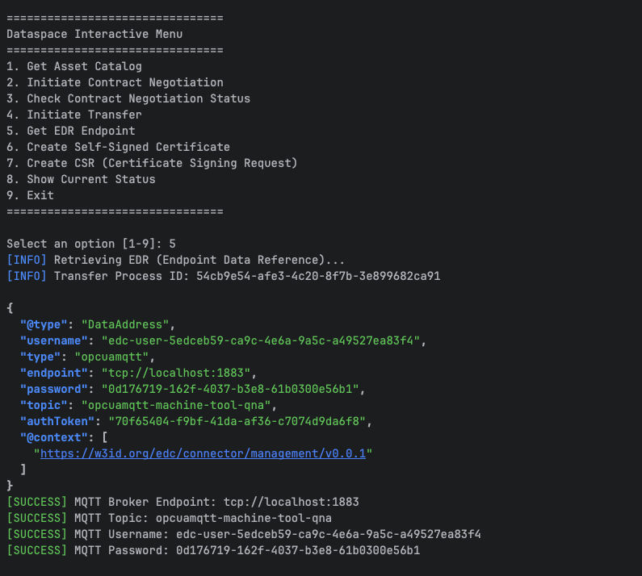

These credentials can be used with any standard MQTT client to connect and read data from the specified topic.

---

### Docker Run

Docker-based configuration is located at:

```
deployment/assets/env/provider_connector_gna.env
```

For the Docker run, Docker Compose is used. First, build the solution:

```bash
cd deployment
docker-compose -f docker-compose.dataspace.yml build
cd ..
```

After a successful build, `run-dataspace-interactive.sh` handles everything — it starts the full stack via Docker Compose, seeds the dataspace, and launches the interactive consumer dialog:

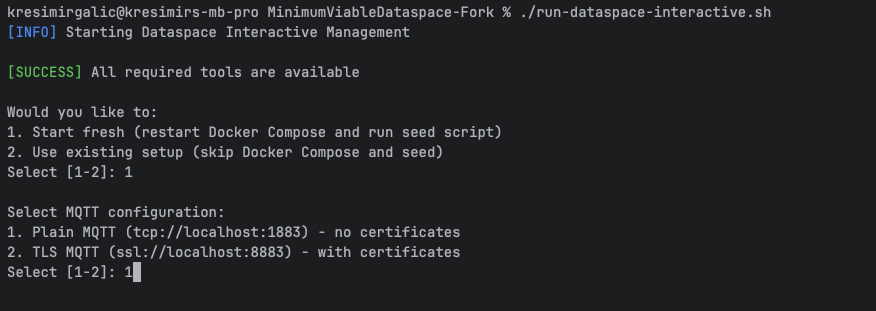

All containers should be visible as running, including the dependencies and the full Minimum Viable Dataspace stack. The interactive dialog follows the same flow as the local run (commands 1–5).

> **Note:** Any configuration change requires rebuilding the Docker images before the changes take effect.

---

### Certificate Run

To enable the certificate-based authentication flow, the relevant `.env` file must be updated accordingly:

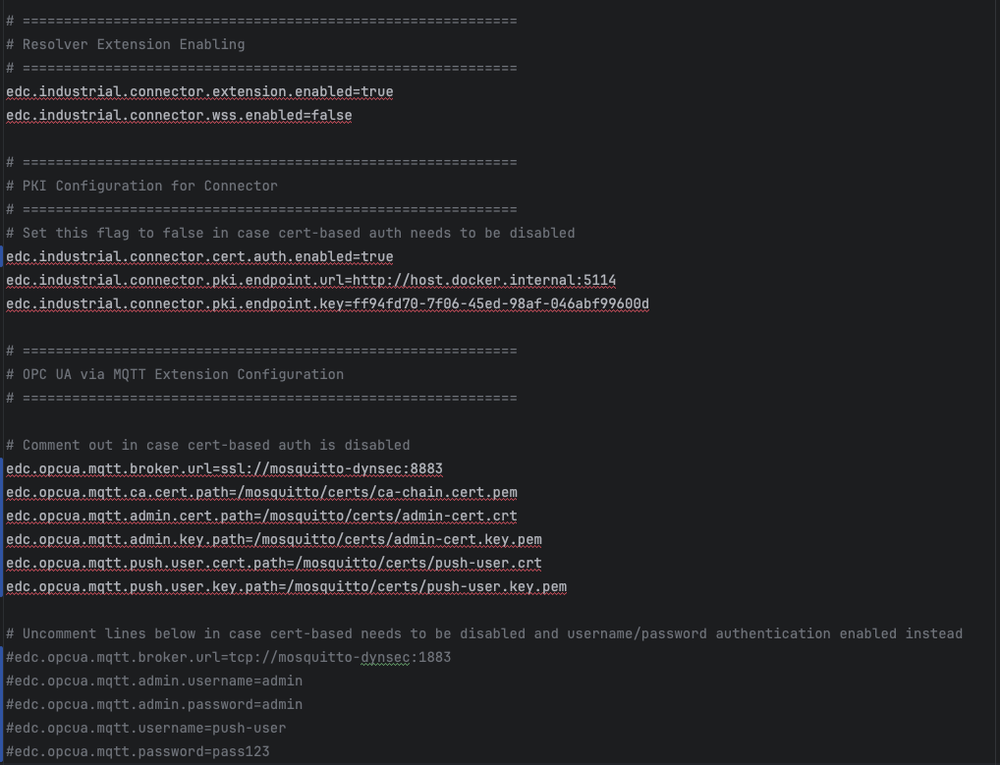

> **Note:** The certificates included in this repository are provisional and intended for development purposes only — sufficient to start the solution with minimal effort. They are not suitable for production use.

Certificates are located under `mosquitto-dynsec/certs/`. Their roles are as follows:

- **`admin-cert`** — regulates roles within the broker (RBAC).
- **`push-cert`** — used by the push task to publish data to the broker.
- **`ca-chain`** — returned to the consumer upon successful transfer.
- **`broker-cert`** — used by the Mosquitto broker itself; referenced in the Mosquitto configuration file.

Any configuration change requires a `docker-compose build` when running the solution in container mode.

#### PKI Service

Before running the solution in certificate mode, the **EDC-Lightweight-PKI-Tool** must also be running. This tool is maintained as a separate repository under the same GitHub organization as this repository.

It exposes two APIs:

- **Consumer API** — allows the consumer to create a self-signed certificate and generate a Certificate Signing Request (CSR).
- **Provider API** — allows the provider to sign the consumer's CSR.

The provider side must be provisioned with the root and intermediate certificates, as the signing operation is performed by this service. This architecture externalizes certificate management from the dataspace, which is the intended design. The PKI service can be replaced with any customer-managed or cloud-vendor certificate management solution.

#### Certificate-Based Flow

Run `run-dataspace-interactive.sh` with certificate authentication enabled:

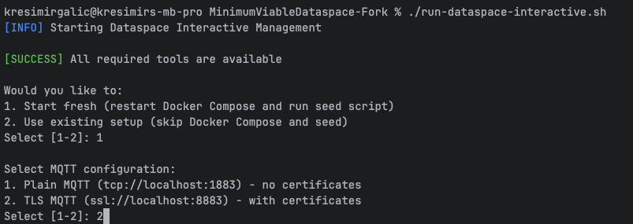

Commands 1–3 remain unchanged: fetch the asset catalog, initiate contract negotiation, and confirm the contract has reached the **FINALIZED** state.

Since certificate-based authentication is now in use, the flow continues as follows:

**Command 6 — Create Self-Signed Certificate** (Consumer side; in the background, this calls the EDC-Lightweight-PKI-Tool Consumer API):

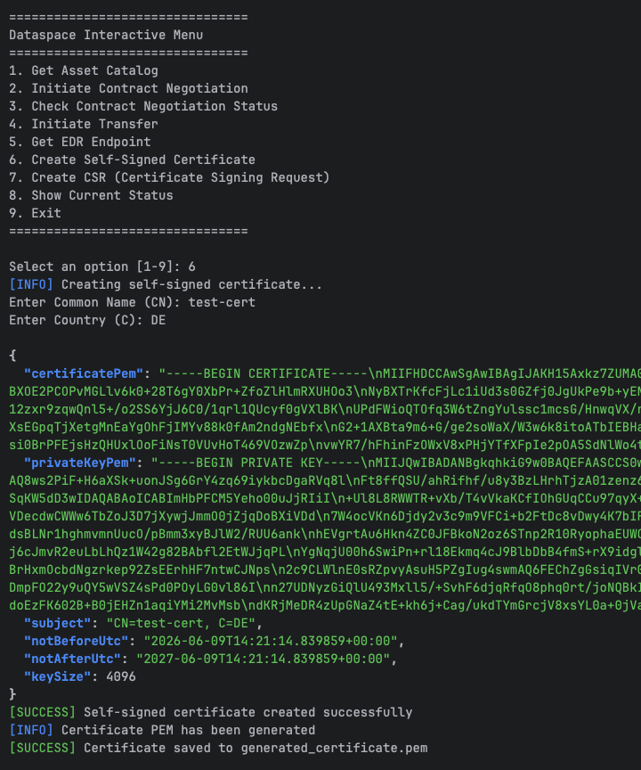

**Command 7 — Create Certificate Signing Request (CSR)**:

The CSR is stored in the temporary memory of the interactive script and used automatically when the transfer is initiated.

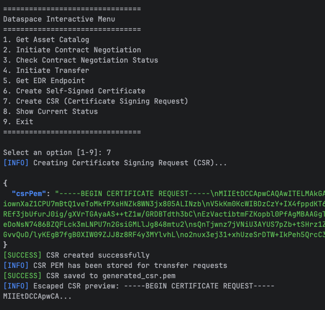

**Command 4 — Initiate Transfer**:

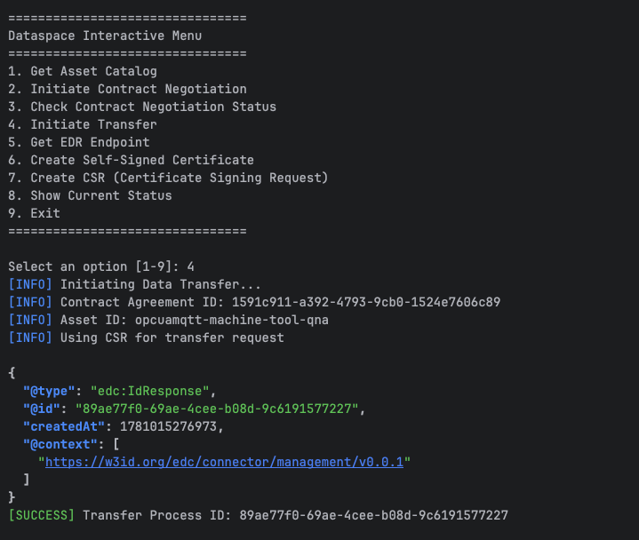

**Command 5 — Get EDR Endpoint**:

The response now includes the **certificate chain**, the **signed certificate**, and the **MQTT topic** — sufficient for the consumer to authenticate with the broker and begin reading data.

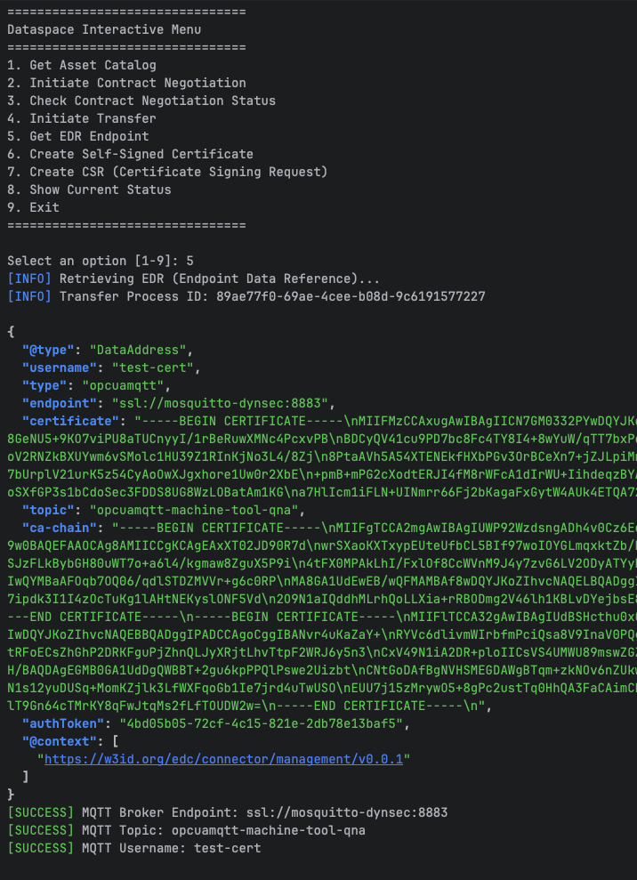

---

## Web Socket

The WebSocket setup outsources communication with the OPC-UA server and the MQTT broker push operations to an external application — **edc-industrial-connector-wss-client** — available in the same GitHub organization as this repository.

To enable WebSocket mode, set `wss.enabled=true` in the connector configuration and follow the setup instructions in the `edc-industrial-connector-wss-client` repository.
